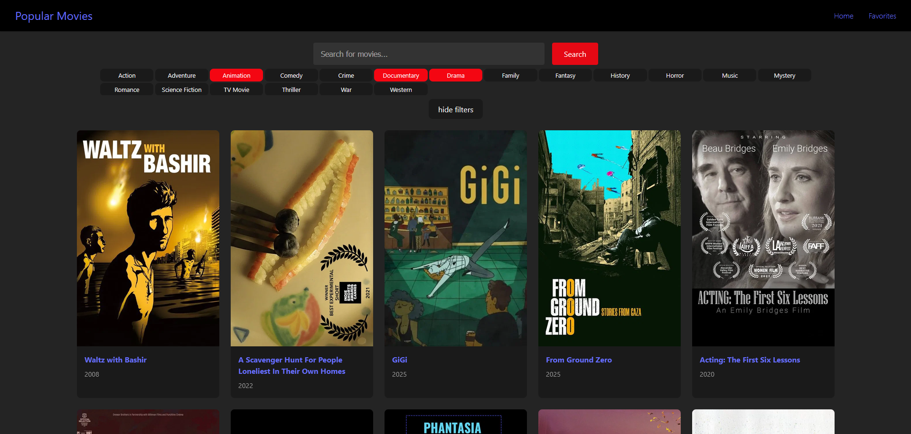
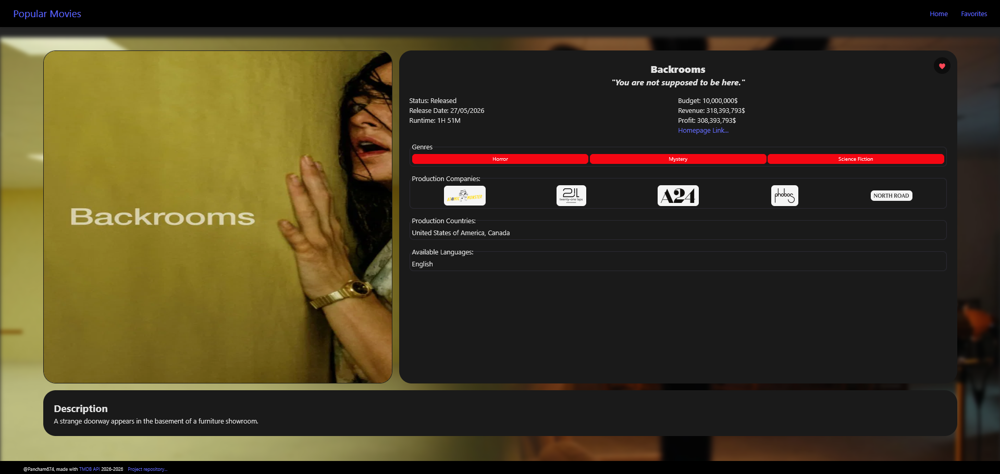
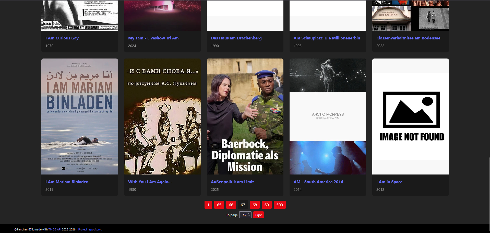

As my first react project I followed a [tutorial by Tech With Tim](https://www.youtube.com/watch?v=G6D9cBaLViA), which I then expanded with my knowledge.

## Original Project
- API calls to get popular movies and movies by their title
- Favoritise and save movies in localStorage
- Display movies in a grid

## My Addition
- Optional genre filtering
- Added page switching (up to 500)
- New page to see details of a specific movie
- API calls to search movies by genres (and filter by title), get different page results and details of a movie

## Images
Home with results from genre filtering

Details page of the backrooms movie

Page switching on the home page

